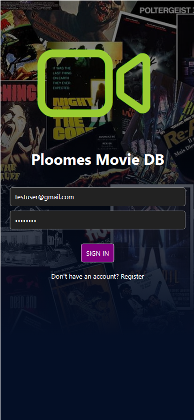
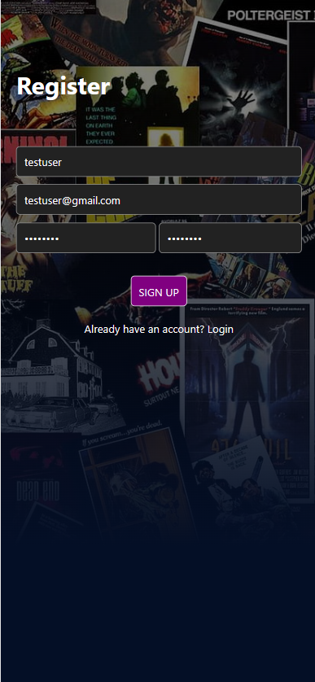
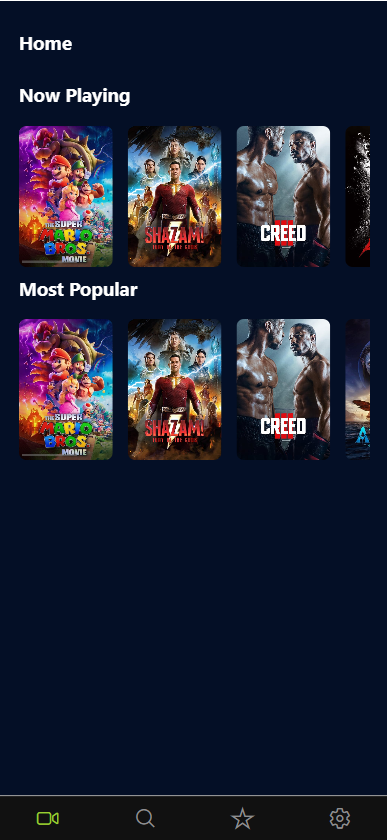
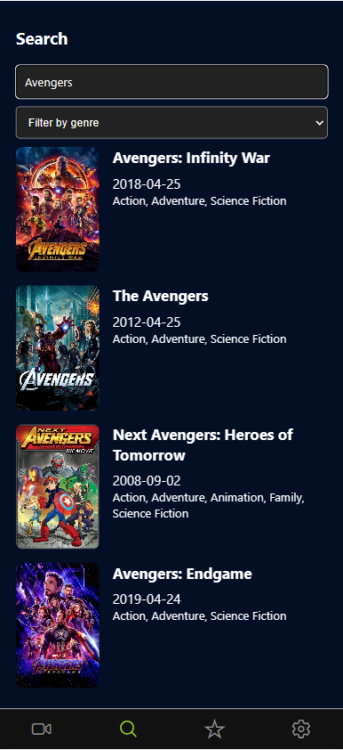
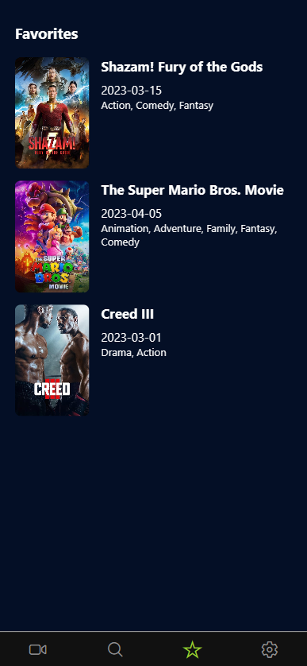

# Ploomes Movies App
This is a simple Expo app that allows you to search for movies and add them to your favorites list.

## Screens
| Login | Register | Home | Search | Favorites | Movie Details |
| --- | --- | --- | --- | --- | --- |
|  |  |  |  |  |  |

## Environment
- Npm 8.3.0
- Node.js 18.15.0
- Expo SDK 48.x.x

## Installation
1. Clone this repository
2. Run `npm install` to install the dependencies
3. Run `npx expo start` to start the app
4. Scan the QR code with your phone

## Public Expo Link
https://expo.io/@victor7095/ploomes-movies-app

## Features
- Search for movies by title or genre
- Add movies to your favorites list
- Remove movies from your favorites list
- View movie details
- Share movies with your friends
- Firebase authentication